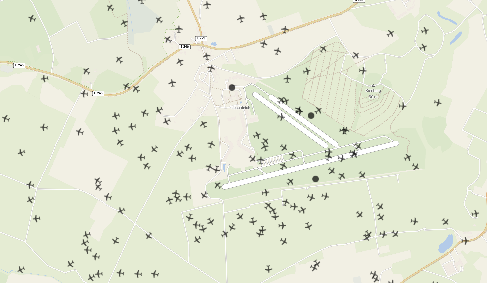

# Skybed
*A Software Testbed for UAV Edge Computing Applications*



SkyBed is an open-source software testbed designed to facilitate the development and testing of edge computing applications for Unmanned Aerial Vehicles (UAVs). It provides a scalable and flexible framework for simulating UAV movements, cellular network interactions, and edge-computing scenarios, enabling researchers to evaluate applications, such as collision avoidance, AI image processing, and more.

### Features
- **Virtual UAV Simulation**: Simulate UAV movement with customizable paths, speeds, and behaviors.
- **Cellular Network Emulation**: Model latency, throughput, and packet loss based on UAV proximity to virtual cell towers.
- **Edge Computing Scenarios**: Test edge-based applications with real-time or precomputed network parameters.
- **Collision Detection**: Detect UAV collisions efficiently using a ball-tree-based algorithm.
- **Scalability**: Simulate hundreds of UAVs simultaneously using containerized vUAVs.
- **Repeatability**: Create repeatable experiments with configurable scenarios.
- **Visualization**: Monitor UAVs and cell towers on an interactive, browser-based map.


## Getting started

### Prerequisites
- Operating System: Linux (WSL2 may work for Windows users)
- Dependencies:
  - Docker
  - Python 3.11+
  - Poetry
- For 6G NeXt Integration:
  - Set up the following:
    - [6gn-functions](https://github.com/ChaosRez/6gn-functions)
    - [6gn-ingester](https://github.com/ChaosRez/6gn-ingester)
    - [tinyFaas](https://github.com/OpenFogStack/tinyFaaS) (requires modifications to support build tools)

### Installation
1. Install Python Dependencies:
    ```shell
    poetry install
    ```
2. Enable Network Configuration without Superuser Privileges:
    ```shell
    sudo setcap cap_net_admin+ep /sbin/tc
    sudo setcap cap_net_raw,cap_net_admin+ep /bin/ip
    ```
3. Build Docker Images (this may take a while):
    ```shell
    docker build -f ns3_lena.Dockerfile -t ns3_lena .
    docker build -f uav.Dockerfile -t uav .
    ```

### Usage
#### Setting Up for Collision Avoidance with 6G NeXt
Follow the instructions in the 6gn-functions repository to configure the anti-collision system.

#### Running the Testbed
When running SkyBed with the following command:

```shell
skybed --help
```

Available options will be displayed:

```shell
 Usage: skybed [OPTIONS] [SCENARIO_FILE] [TEST_SYSTEM_IP]                                                                                                                                                                                  
                                                                                                                                                                                                                                           
╭─ Arguments ─────────────────────────────────────────────────────────────────────────────────────────────────────────────────────────────────────────────────────────────────────────────────────────────────────────────────────────────╮
│   scenario_file       [SCENARIO_FILE]   [default: schoenhagen_near_collision]                                                                                                                                                           │
│   test_system_ip      [TEST_SYSTEM_IP]  [default: localhost]                                                                                                                                                                            │
╰─────────────────────────────────────────────────────────────────────────────────────────────────────────────────────────────────────────────────────────────────────────────────────────────────────────────────────────────────────────╯
```

#### Viewing the Visualization
Open your browser and navigate to:

http://localhost:8050

#### Example Scenario
The `schoenhagen_many_drones` scenario simulates 200 UAVs flying near Schönhagen Airport to test collision detection and network performance under heavy load.

To run this scenario:
```shell
skybed schoenhagen_many_drones
```

Additional scenarios are located in the skybed/scenarios directory. To create a custom scenario:

1. Copy an existing file from skybed/scenarios/.
2. Edit the UAV paths, speeds, or network configurations to match your requirements.

## Acknowledgments
SkyBed was developed as part of a Master's thesis at the Technische Universität Berlin. The thesis can be read [here](documentation/thesis.pdf).
